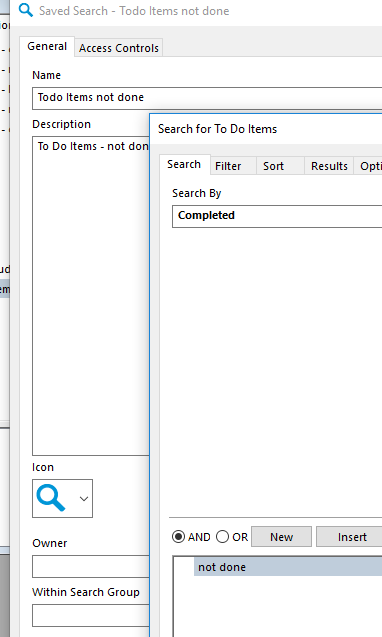
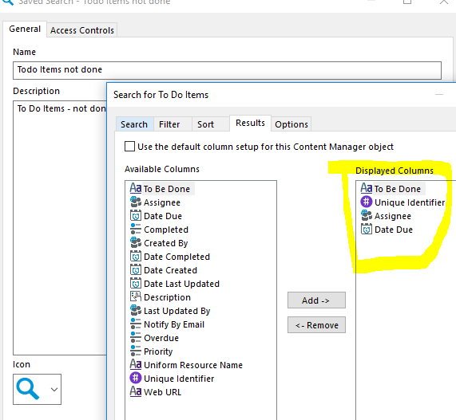
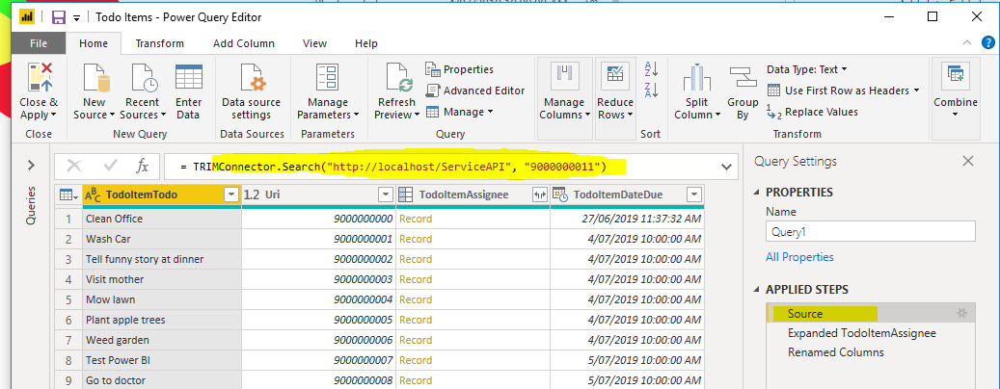
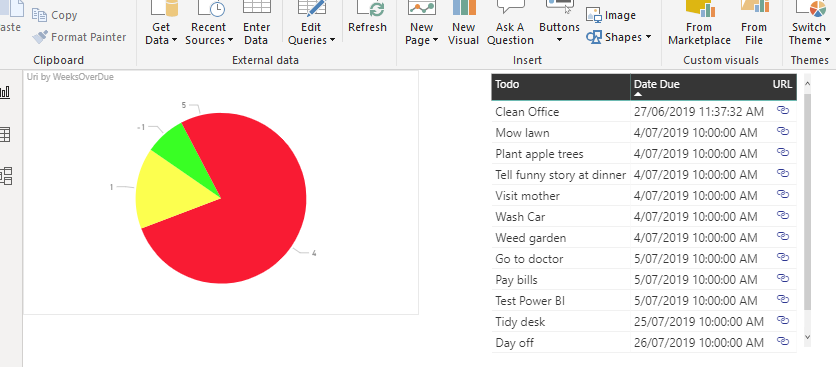

# Power BI Todo Item Sample
'Todo Items.pbix' is a sample Power BI report showing To do Items not completed by person.  Techniques similar to those used in this sample could be used for other visualizations, such as:
 * all Records created this week by Record Type
 * Records checked out to me by weeks checked out
 * Activites Due my action
 * Records due for deletion
 * Audit events by type

## Instructions
To use this sample:
 1. in CM create a Todo Item saved search of items not completed (see image 1),
 2. select the columns To Be Done, Uri, Assignee, and Date Due (see image 2),
 3. download and open the PBIX file and 'Edit Queries'
 4. change the URL and saved search Uri (or name) in the source (see image 3), 
 5. in Data Source settings set the correct credentials for your ServiceAPI instance,
 6, close the Query Editor and edit the URL computed column to point to your instance of the CM Web Client, then
 7. assuming you have some incomplete To Do Items you should see something like image 4.
 
## Things to look for
Things to take note of in this sample:
 * a Pie chart does not support [conditional formatting](https://docs.microsoft.com/en-us/power-bi/visuals/service-tips-and-tricks-for-color-formatting) of Data Colors, to see the formatting:
     * switch the pie chart to a bar chart
	 * in Data Colors select 'Conditional Formatting' from the ellipsis menu
	 * note the color comes from the computed column ColorPriority
 * the URL is based on a [computed column](https://docs.microsoft.com/en-us/power-bi/power-bi-hyperlinks-in-tables) in the data	 
 * Todo items can be filtered based on the Assignee using [row level security](https://docs.microsoft.com/en-us/power-bi/service-admin-rls)
 * reports like this can be [published](https://docs.microsoft.com/en-us/power-bi/desktop-upload-desktop-files) to Power BI in the cloud and connected to CM on-premise using a [gateway](https://docs.microsoft.com/en-us/power-bi/service-gateway-onprem)
 
## Row level security
For row level security (RLS) to work there needs to be a value in either LogsInAs or AdditionalLogin that matches the user name Power BI hs for you.  If published to the cloud this will likely by your UPN, for example (```david@acme.com```).  To make RLS work you may need to add the UPF for each of your users to the 'Alternative Login' in their Location.
 
## Images

### Image 1


### Image 2


### Image 3


### Image 4

